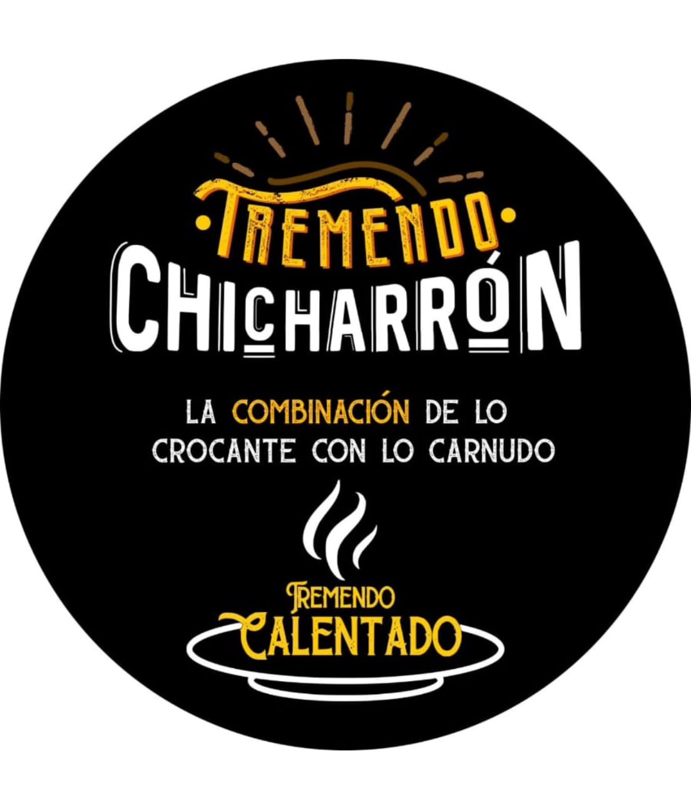

# 🐷 Tremendo Chicharrón — Domicilios en Manizales



**Sistema completo de pedidos a domicilio para "Tremendo Chicharrón"**, una cocina oculta (ghost kitchen) 100% domicilios en Manizales, Colombia. La plataforma permite a los clientes ver el menú digital con modelos 3D interactivos, armar su carrito, hacer pedidos a domicilio con geolocalización, pagar por WhatsApp, y seguir el estado de su pedido en tiempo real. Incluye paneles administrativos para la cajera (admin) y para el dueño (superadmin).

---

## 📋 Tabla de contenidos

1. [Descripción general](#-descripción-general)
2. [Tecnologías](#-tecnologías)
3. [Estructura de archivos](#-estructura-de-archivos)
4. [Base de datos (Supabase/PostgreSQL)](#-base-de-datos-supabasepostgresql)
5. [Animaciones 3D](#-animaciones-3d)
6. [Rutas y flujo de la aplicación](#-rutas-y-flujo-de-la-aplicación)
7. [Roles y paneles](#-roles-y-paneles)
8. [Variables de entorno](#-variables-de-entorno)
9. [Instalación y desarrollo](#-instalación-y-desarrollo)
10. [Problemas conocidos y pendientes](#-problemas-conocidos-y-pendientes)

---

## 🏪 Descripción general

> Cocina oculta en Manizales especializada en chicharrón, calentados, picadas, paella de chicharrón y más. 100% venta por domicilio.

### Funcionalidades principales

| Área                             | Descripción                                                                                                                                                                    |
| -------------------------------- | ------------------------------------------------------------------------------------------------------------------------------------------------------------------------------ |
| **Menú digital**                 | Carta completa con categorías (Desayunos, Almuerzos, Para Picar/Tardear, Bebidas), precios, agotados y modelos 3D de los platos destacados.                                    |
| **Carrito de compras**           | Sistema de carrito con variantes por persona (Tremenda Picada), combos gratis (Hamburguesa), notas para la cocina y cantidades.                                                |
| **Pedidos**                      | Creación de pedidos con nombre, teléfono, dirección, geolocalización en mapa (Leaflet + OpenStreetMap + Nominatim), y 3 medios de pago.                                        |
| **Pago por WhatsApp**            | El cliente confirma el pago enviando un mensaje prellenado de WhatsApp con el detalle de la comanda.                                                                           |
| **Seguimiento en tiempo real**   | El cliente consulta su pedido por número de comanda + teléfono y ve el progreso (confirmación → pago → cocina → en camino → entregado) con suscripciones Realtime de Supabase. |
| **Sistema de comandas**          | Número de comanda único formato `TC-YYMMDD-NNN`, versionado con histórico de ediciones.                                                                                        |
| **Chat con IA (Don Velto)**      | Mesero virtual impulsado por Groq (LLaMA 3.3 70B) que conoce la carta y recomienda platos según antojo, presupuesto y número de personas.                                      |
| **Panel de caja (admin)**        | Pedidos entrantes en tiempo real, confirmación de domicilio, confirmación de pago, cambio de estados e impresión de comandas.                                                  |
| **Panel del dueño (superadmin)** | Gestión de productos, promociones, imágenes (Supabase Storage), toggle abrir/cerrar negocio, estadísticas de ventas, exportación de reportes Excel/PDF y alertas de respaldo.  |
| **Mi Chicharronera**             | Historial de pedidos del cliente por teléfono, con botón "Ir a pagar" para pedidos pendientes.                                                                                 |
| **Mini-login de cliente**        | Modal que registra nombre + teléfono del cliente (localStorage + Supabase) para precargar sus datos en futuros pedidos.                                                        |
| **Horarios inteligentes**        | La app detecta automáticamente si el negocio está abierto según el horario de atención en zona horaria _America/Bogota_.                                                       |

### Horarios de atención

| Días             | Horario            |
| ---------------- | ------------------ |
| Lunes a jueves   | 8:00 AM – 8:00 PM  |
| Viernes y sábado | 8:00 AM – 11:00 PM |
| Domingo          | 7:00 AM – 4:00 PM  |

---

## 🛠️ Tecnologías

### Frontend

| Tecnología                  | Versión         | Uso                                                     |
| --------------------------- | --------------- | ------------------------------------------------------- |
| **React**                   | ^19.2.0         | UI                                                      |
| **TanStack Start**          | 1.168.32        | Framework meta (SSR)                                    |
| **TanStack Router**         | 1.170.18        | Enrutamiento con generación de rutas                    |
| **TanStack React Query**    | ^5.101.1        | Estado de servidor                                      |
| **TypeScript**              | ^5.8.3          | Tipado estático                                         |
| **Vite**                    | ^8.2.0          | Bundler                                                 |
| **Tailwind CSS**            | ^4.2.1          | Estilos con sistema de diseño custom (oklch)            |
| **@google/model-viewer**    | ^4.3.1          | Visualización de modelos 3D GLB                         |
| **Leaflet / React-Leaflet** | ^1.9.4 / ^5.0.0 | Mapa de ubicación de entrega                            |
| **Recharts**                | ^2.15.4         | Gráficas (disponible en UI components)                  |
| **Radix UI**                | —               | Componentes de accesibilidad (modales, dropdowns, etc.) |
| **shadcn/ui**               | —               | Componentes sobre Radix + Tailwind                      |
| **sonner**                  | ^2.0.7          | Notificaciones tipo toast                               |
| **lucide-react**            | ^0.575.0        | Iconografía                                             |
| **react-hook-form + zod**   | —               | Formularios (disponible en UI components)               |

### Backend / Datos

| Tecnología                    | Uso                                                                       |
| ----------------------------- | ------------------------------------------------------------------------- |
| **Supabase** (PostgreSQL)     | Base de datos, Auth, Realtime, Storage                                    |
| **pg_cron**                   | Tareas programadas (auto-cancelación de pedidos, limpieza de rate limits) |
| **Row Level Security (RLS)**  | Políticas de seguridad a nivel de fila                                    |
| **Groq API**                  | Chat IA de Don Velto (modelo `llama-3.3-70b-versatile`)                   |
| **Nominatim / OpenStreetMap** | Geocodificación inversa de direcciones                                    |

---

## 📁 Estructura de archivos

```
Tremendo_Chicharron/
├── AGENTS.md                     # Instrucciones para agents (Lovable)
├── bunfig.toml                   # Configuración de Bun
├── bun.lock                      # Lockfile de Bun
├── package.json                  # Dependencias y scripts
├── package-lock.json             # Lockfile de npm
├── tsconfig.json                 # Configuración de TypeScript
├── vite.config.ts                # Configuración de Vite
├── eslint.config.js              # Configuración de ESLint
├── .prettierrc                   # Prettier config
├── .prettierignore
├── .gitignore
│
├── database/                     # 🗄️ Scripts SQL para Supabase
│   ├── 01_esquema.sql            # Tipos, tablas, índices, triggers y funciones base
│   ├── 02_rls.sql                # Políticas de Row Level Security + RPC público
│   ├── 03_cron_y_funciones.sql   # pg_cron, rate limiting y métricas
│   └── 04_datos_iniciales.sql    # Carta completa: categorías, productos, promociones
│
├── public/                       # 📦 Archivos estáticos y assets
│   ├── *.glb / *.fbx             # Modelos 3D (ver sección 3D)
│   ├── *.png / *.jpeg            # Logos, iconos, imagenes de la app
│   └── favicon.ico
│
└── src/
    ├── router.tsx                # Configuración del router
    ├── routeTree.gen.ts          # Árbol de rutas generado automáticamente
    ├── server.ts                 # Servidor TanStack Start
    ├── start.ts                  # Entry point de arranque
    ├── styles.css                # Sistema de diseño (temas oklch, animaciones)
    │
    ├── components/               # 🧩 Componentes React
    │   ├── DonVelto.tsx              # Chat IA (mesero virtual)
    │   ├── FondoGlobal.tsx           # Fondo fijo con imagen + gradiente
    │   ├── MapaUbicacion.tsx         # Modal de mapa Leaflet para dirección
    │   ├── Marca.tsx                 # Footer institucional (nosotros + creditos Velto)
    │   ├── MiniLoginCliente.tsx      # Modal de registro de cliente (nombre + teléfono)
    │   ├── Model3DPlaceholder.tsx    # Renderiza modelos GLB con <model-viewer>
    │   └── ui/                       # Componentes shadcn/ui (button, card, dialog, etc.)
    │
    ├── hooks/
    │   └── use-mobile.tsx            # Hook responsive
    │
    ├── lib/                       # 🔧 Lógica de negocio y utilidades
    │   ├── auth-staff.ts             # Autenticación staff (Supabase Auth + roles)
    │   ├── clientes.ts               # Registro de clientes (local + Supabase)
    │   ├── documentos.ts             # Impresión de comandas, facturas, WhatsApp, Excel/PDF
    │   ├── error-capture.ts          # Captura de errores
    │   ├── error-page.ts             # Página de error
    │   ├── lovable-error-reporting.ts # Reporte de errores a Lovable
    │   ├── menu-data.ts              # Datos semilla del menú (categorías, productos, promos, horarios)
    │   ├── store.ts                  # Estado global (localStorage) + operaciones de pedido/carrito
    │   ├── supabase.ts               # Cliente Supabase singleton
    │   ├── use-menu-data.ts          # Hook para cargar menú desde Supabase
    │   ├── use-pedidos.ts            # Hook de pedidos con suscripción Realtime
    │   └── utils.ts                  # Utilidades (shadcn)
    │
    └── routes/                    # 🗺️ Rutas de la aplicación (TanStack Router)
        ├── __root.tsx                 # Root layout (QueryClient, FondoGlobal)
        ├── index.tsx                  # / — Portada con estado abierto/cerrado
        ├── menu.tsx                   # /menu — Menú con 3D, carrito y Don Velto
        ├── pedido.tsx                 # /pedido — Checkout (datos, pago, mapa)
        ├── confirmacion.$comanda.tsx  # /confirmacion/:comanda — Confirmación
        ├── pedido.$numero_comanda.tsx # /pedido/:numero_comanda — Seguimiento del pedido
        ├── mi-chicharronera.tsx       # /mi-chicharronera — Historial del cliente
        ├── progreso.tsx               # /progreso — (en desarrollo)
        ├── admin.login.tsx            # /admin/login — Login de la cajera
        ├── admin.tsx                  # /admin — Panel de caja (pedidos en tiempo real)
        ├── superadmin.login.tsx       # /superadmin/login — Login del dueño
        ├── superadmin.tsx             # /superadmin — Panel del dueño (menú, stats, promos)
        └── README.md                  # Documentación interna de rutas
```

---

## 🗄️ Base de datos (Supabase/PostgreSQL)

La base de datos está definida en **4 scripts SQL** que deben ejecutarse en orden en el SQL Editor de Supabase.

### Tablas

| Tabla                | Descripción                                                                                                                                                          |
| -------------------- | -------------------------------------------------------------------------------------------------------------------------------------------------------------------- |
| `usuarios`           | Roles del staff (`superadmin` = dueño, `admin` = cajera). Vinculada a `auth.users` por `user_id`.                                                                    |
| `configuracion`      | Fila única con `negocio_abierto` (interruptor global) y `ultimo_respaldo`.                                                                                           |
| `categorias`         | Categorías del menú: Desayunos, Almuerzos, Para Picar/Tardear, Bebidas. Incluye `plato_destacado_id` (referencia circular con productos) y `modelo_3d_url`.          |
| `productos`          | Platos con nombre, descripción, precio (nullable), imagen, disponible (sold out), `destacado_3d`, `modelo_3d_url`, `por_persona` y `combo_gratis`.                   |
| `variantes_precio`   | Precios por cantidad de personas (Picada: 1→$34.000, 2→$60.000, …, 10→$295.000).                                                                                     |
| `promociones`        | Promociones fijas, rotativas o por fecha, con activación/desactivación.                                                                                              |
| `clientes`           | Clientes registrados (nombre + teléfono único).                                                                                                                      |
| `pedidos`            | Pedidos con `numero_comanda` generado automáticamente (`TC-YYMMDD-NNN`), datos del cliente, dirección + geolocalización, medio de pago, montos, estado y versionado. |
| `pedido_items`       | Líneas de cada pedido con **snapshot** de nombre y precio (no cambia si editan el menú después).                                                                     |
| `historico_comandas` | Auditoría de versiones anuladas de comandas al editar (JSONB snapshot). Nunca se procesan.                                                                           |
| `rate_limits`        | Contadores de rate limiting por IP/sesión y acción (crear_pedido, chat_don_velto).                                                                                   |

### Tipos (Enums)

```sql
rol_usuario       → 'superadmin' | 'admin'
estado_pedido     → 'pendiente_confirmacion_cajera' | 'pendiente_pago' | 'pago_confirmado'
                    | 'en_cocina' | 'en_preparacion' | 'en_camino' | 'entregado' | 'cancelado'
medio_pago        → 'efectivo' | 'transferencia' | 'tarjeta'
tipo_vigencia     → 'fija' | 'rotativa' | 'por_fecha'
```

### Flujo de estados del pedido

```
pendiente_confirmacion_cajera
        │  (la cajera confirma domicilio)
        ▼
pendiente_pago
        │  (cliente paga por WhatsApp → cajera confirma)
        ▼
pago_confirmado ──► en_cocina ──► en_preparacion ──► en_camino ──► entregado
        │
        └──► cancelado  (auto-cancelación a los 30 min sin pago, vía pg_cron)
```

### Seguridad (Row Level Security)

- **Lectura pública**: categorías, productos, variantes de precio y configuracion (menú público).
- **Promociones**: solo se listan públicamente las activas (`activa or es_staff(auth.uid())`).
- **Escritura de menú**: solo `superadmin`.
- **Pedidos anónimos**: el cliente puede insertar pedidos solo si el negocio está abierto y con estados iniciales válidos. No puede enumerar pedidos ajenos (toda consulta pública pasa por la RPC `consultar_pedido_por_comanda_y_telefono()`).
- **Ventana de edición de 10 minutos**: el cliente puede editar su comanda solo dentro de `editable_hasta`.
- **Staff**: lectura y actualización de todos los pedidos.
- **Borrado**: solo `superadmin`.

### Funciones y automatismos

| Función / Trigger                           | Descripción                                                                                                   |
| ------------------------------------------- | ------------------------------------------------------------------------------------------------------------- |
| `generar_numero_comanda()`                  | Genera `TC-YYMMDD-NNN` usando una secuencia global.                                                           |
| `tiene_rol(user_id, rol)`                   | SECURITY DEFINER para verificar rol sin recursión en políticas.                                               |
| `es_staff(user_id)`                         | Verifica si el usuario es staff.                                                                              |
| `consultar_pedido_por_comanda_y_telefono()` | RPC pública segura: devuelve pedido + items SOLO si coinciden comanda Y teléfono.                             |
| `archivar_version_comanda()`                | Trigger: al actualizar con `new.version > old.version`, archiva el snapshot anterior en `historico_comandas`. |
| `cancelar_pedidos_vencidos()`               | Cron cada minuto: cancela pedidos sin pago con más de 30 minutos.                                             |
| `consumir_rate_limit()`                     | Rate limiting por acción (crear_pedido: 5/min, chat_don_velto: 8/min).                                        |
| `metricas_mensuales`                        | Vista de ventas mensuales (pedidos válidos, cancelados, total, ticket promedio).                              |

### Datos iniciales (carta completa)

- **4 categorías**: Desayunos, Almuerzos, Para Picar/Tardear, Bebidas.
- **28 productos** (10 desayunos, 8 almuerzos, 5 para picar/tardear, 4 bebidas).
- **Picada por persona**: 1→$34.000, 2→$60.000, 3→$86.000, 4→$120.000, 5→$150.500, 6→$175.000, 8→$230.000, 10→$295.000.
- **1 promoción inicial**: "Día del Padre — Desayuno Sorpresa".

---

## 🎮 Animaciones 3D

La aplicación usa **`@google/model-viewer`** para renderizar modelos 3D **GLB** de los platos destacados. El componente `Model3DPlaceholder.tsx` carga el web component de forma dinámica (solo cliente, no SSR) y configura el modelo con:

- `auto-rotate` + `rotation-per-second="12deg"` — rotación continua
- `camera-controls` — control de cámara por el usuario
- `shadow-intensity="1"` — sombras realistas
- `environment-image="neutral"` — iluminación neutral
- `ar` + `ar-modes="webxr scene-viewer quick-look"` — **soporte de Realidad Aumentada**
- `disable-tap` — evita conflictos con scroll en móvil
- Fallback a icono animado (`animate-float`) si el modelo no es GLB o no se cargó el web component

### Modelos disponibles en `public/`

| Archivo                                  | Categoría          | Producto destacado            | Ubicación en la app    |
| ---------------------------------------- | ------------------ | ----------------------------- | ---------------------- |
| `desayunos-tremendo-chicharron.glb`      | Desayunos          | Tremendo Chicharrón (300g)    | Menú → Desayunos       |
| `desayunos-tremendo-calentado-paisa.glb` | Desayunos          | Tremendo Calentado Paisa      | Menú → Desayunos       |
| `almuerzos-paella-chicharron.glb`        | Almuerzos          | Tremenda Paella de Chicharrón | Menú → Almuerzos       |
| `almuerzos-bowl-montanero.glb`           | Almuerzos          | Tremendo Bowl Montañero       | Menú → Almuerzos       |
| `picar-tardear-chicharron.glb`           | Para Picar/Tardear | Tremenda Picada de Chicharrón | Menú → Para Picar      |
| `Medalla.glb` / `Medalla.fbx`            | —                  | Medalla (celebración)         | Confirmación de pedido |
| `Corona.glb` / `Corona.fbx`              | —                  | Corona (celebración)          | Confirmación de pedido |

> **Nota**: Los archivos `.fbx` (Medalla, Corona) no son compatibles con `<model-viewer>` (solo GLB/GLTF). El componente muestra un placeholder con icono animado cuando el `src` no termina en `.glb`. Se recomienda convertir los `.fbx` a `.glb` para que se rendericen correctamente.

### Animaciones CSS (styles.css)

| Animación             | Descripción                                                                          |
| --------------------- | ------------------------------------------------------------------------------------ |
| `animate-float`       | Flotación suave con rotación (5s ease-in-out infinite) — usada en el placeholder 3D. |
| `animate-shimmer`     | Efecto shimmer/brillo (2.5s linear infinite) — para estados de carga.                |
| `text-gradient-brasa` | Texto con gradiente dorado-brasa.                                                    |
| `bg-brasa`            | Fondo sólido color brasa (dorado).                                                   |
| `shadow-glow`         | Sombra con resplandor dorado.                                                        |
| `shadow-card`         | Sombra de tarjeta.                                                                   |

---

## 🗺️ Rutas y flujo de la aplicación

| Ruta                      | Página               | Descripción                                                                                                                                                      |
| ------------------------- | -------------------- | ---------------------------------------------------------------------------------------------------------------------------------------------------------------- |
| `/`                       | **Portada**          | Logo, estado abierto/cerrado, botones "Ver Menú" y "Mi Chicharronera", horarios, redes sociales.                                                                 |
| `/menu`                   | **Menú**             | Categorías con tabs, modelos 3D destacados, productos con precios, carrito flotante, modal de agregar producto (variantes por persona, combo, notas), Don Velto. |
| `/pedido`                 | **Checkout**         | Resumen del carrito, datos del cliente (nombre, teléfono, dirección), mapa de ubicación, medio de pago (efectivo/transferencia/tarjeta), cálculo de vuelto.      |
| `/confirmacion/:comanda`  | **Confirmación**     | Número de comanda, modelos 3D de celebración (Medalla/Corona), resumen del pedido, botón "Ver estado de mi pedido".                                              |
| `/pedido/:numero_comanda` | **Seguimiento**      | Consulta por teléfono (RPC segura), timeline de estados, botón "Ir a Pagar" (WhatsApp) cuando está pendiente de pago, suscripción Realtime.                      |
| `/mi-chicharronera`       | **Mi Chicharronera** | Historial de pedidos del cliente por teléfono, con botón "Ir a Pagar" para pendientes.                                                                           |
| `/admin/login`            | **Login cajera**     | Autenticación con Supabase Auth, verifica rol `admin`.                                                                                                           |
| `/admin`                  | **Panel de caja**    | Pedidos en tiempo real, filtros por estado, confirmar domicilio, confirmar pago, cambiar estados, imprimir comanda.                                              |
| `/superadmin/login`       | **Login dueño**      | Autenticación con Supabase Auth, verifica rol `superadmin`.                                                                                                      |
| `/superadmin`             | **Panel del dueño**  | Tabs: Menú (CRUD productos, toggle agotado, subir imágenes), Estadísticas (KPIs, top 5, exportar Excel/PDF), Promociones (CRUD). Toggle abrir/cerrar negocio.    |
| `/progreso`               | **Progreso**         | Ruta en desarrollo.                                                                                                                                              |

### Flujo del cliente

```
Portada → Menú → Agregar al carrito → Checkout → Confirmación
                                              ↓
                              Seguimiento (por comanda + teléfono)
                                              ↓
                              Pago por WhatsApp → Entregado
```

---

## 👥 Roles y paneles

### Cliente (sin login)

- Ve el menú y los modelos 3D.
- Arma el carrito con variantes y notas.
- Hace pedidos con dirección y geolocalización.
- Paga por WhatsApp.
- Sigue su pedido en tiempo real.
- Consulta su historial en "Mi Chicharronera".

### Cajera (rol `admin`)

- Ve todos los pedidos en tiempo real.
- Confirma el valor del domicilio.
- Confirma el pago.
- Cambia estados (cocina, preparación, en camino, entregado).
- Imprime comandas.
- Cancela pedidos.

### Dueño (rol `superadmin`)

- Todo lo de la cajera.
- CRUD de productos y promociones.
- Sube imágenes a Supabase Storage.
- Toggle abrir/cerrar negocio.
- Marca productos como agotados.
- Ve estadísticas de ventas.
- Exporta reportes Excel/PDF.
- Recibe alertas de respaldo (30 días).

---

## 🔐 Variables de entorno

Crea un archivo `.env` en la raíz del proyecto:

```env
# Supabase
VITE_SUPABASE_URL=tu-url-de-supabase
VITE_SUPABASE_ANON_KEY=tu-anon-key

# Groq (chat Don Velto)
VITE_GROQ_API_KEY=tu-api-key-de-groq

# WhatsApp del restaurante (número con código de país, sin +)
VITE_RESTAURANT_WHATSAPP_NUMBER=573001234567
```

---

## 🚀 Instalación y desarrollo

### Requisitos

- Node.js 18+ (o Bun)
- npm o bun

### Instalación

```sh
# Con npm
npm install

# Con bun
bun install
```

### Desarrollo

```sh
npm run dev
# o
bun run dev
```

### Build de producción

```sh
npm run build
npm run preview
```

### Scripts disponibles

| Script              | Descripción                     |
| ------------------- | ------------------------------- |
| `npm run dev`       | Servidor de desarrollo con Vite |
| `npm run build`     | Build de producción             |
| `npm run build:dev` | Build en modo desarrollo        |
| `npm run preview`   | Previsualizar build             |
| `npm run lint`      | ESLint                          |
| `npm run format`    | Prettier                        |

### Configuración de la base de datos

1. Crea un proyecto en [Supabase](https://supabase.com).
2. En el SQL Editor, ejecuta los scripts en orden:
   - `database/01_esquema.sql`
   - `database/02_rls.sql`
   - `database/03_cron_y_funciones.sql`
   - `database/04_datos_iniciales.sql`
3. Crea los usuarios del staff en **Auth > Users** (dueño y cajera).
4. Inserta los roles en la tabla `usuarios` (ver comentario al final de `04_datos_iniciales.sql`).
5. Crea el bucket `menu-imagenes` en **Storage** para las imágenes de productos/promociones.
6. Configura las variables de entorno en `.env`.

---

## ⚠️ Problemas conocidos y pendientes

### Problemas actuales

1. **Modelos `.fbx` no renderizan**: Los archivos `Medalla.fbx` y `Corona.fbx` no son compatibles con `<model-viewer>` (solo acepta GLB/GLTF). Se muestran como placeholder con icono. **Solución**: convertir a `.glb` (ya existen `Medalla.glb` y `Corona.glb` en `public/`, pero el código en `confirmacion.$comanda.tsx` apunta a los `.fbx`).

2. **Doble capa de datos (local + Supabase)**: El `store.ts` mantiene estado en `localStorage` y también inserta en Supabase. Esto puede causar inconsistencias si ambos no se sincronizan correctamente. El flujo real de producción debería depender solo de Supabase.

3. **`useMenuData` no tiene fallback local**: Si Supabase no está configurado, el menú muestra error en lugar de usar los datos semilla de `menu-data.ts`. El componente `DonVelto` usa `useMenuData` y fallaría sin Supabase.

4. **Rate limiting del chat solo en cliente**: El rate limit de Don Velto (8 msgs/min) se implementa solo en el cliente (`stamps` en `DonVelto.tsx`). El definitivo debería estar en una Edge Function de Supabase usando `consumir_rate_limit()`.

5. **`VITE_GROQ_API_KEY` expuesta en el cliente**: La API key de Groq se usa directamente desde el navegador (`fetch` a `api.groq.com`). Esto expone la key en el bundle. **Solución**: mover a una Edge Function de Supabase.

6. **Ruta `/progreso` incompleta**: Existe el archivo `src/routes/progreso.tsx` pero no está documentada ni parece tener funcionalidad completa.

7. **`clientes_update_propio` sin restricción real**: La política de actualización de clientes usa `using (true) with check (true)`, lo que permite a cualquier cliente anónimo actualizar cualquier fila de la tabla `clientes` (aunque solo puede leer las que coinciden con su teléfono vía header).

8. **`items_select_publico` expone todos los items**: La política `items_select_publico` permite a cualquier anónimo leer todos los `pedido_items` de la base de datos, lo que podría filtrar información de pedidos ajenos.

9. **Imagen de Don Velto**: El componente `DonVelto.tsx` referencia `/donvelto.png` pero el archivo en `public/` se llama `velto.png`. La imagen no se muestra (fallback oculta la imagen).

10. **NIT hardcodeado**: El NIT `901.433.592-5` está hardcodeado en `documentos.ts` y `Marca.tsx`. Debería estar en configuración.

### Pendientes / Mejoras sugeridas

- [ ] Convertir `Medalla.fbx` y `Corona.fbx` a `.glb` y actualizar las rutas en `confirmacion.$comanda.tsx`.
- [ ] Mover la API key de Groq a una Edge Function de Supabase.
- [ ] Implementar rate limiting del lado servidor para `crear_pedido` y `chat_don_velto`.
- [ ] Unificar la capa de datos: eliminar dependencia de `localStorage` y usar solo Supabase.
- [ ] Agregar fallback a datos semilla cuando Supabase no está disponible.
- [ ] Corregir la política `items_select_publico` para no exponer items de pedidos ajenos.
- [ ] Corregir la política `clientes_update_propio` para restringir por teléfono.
- [ ] Corregir la referencia de imagen de Don Velto (`/donvelto.png` → `/velto.png`).
- [ ] Mover el NIT a la tabla `configuracion`.
- [ ] Completar la ruta `/progreso`.
- [ ] Agregar Edge Functions para crear pedidos y chat con IA.
- [ ] Implementar pasarela de pago real (Stripe, Wompi, etc.) en lugar de solo WhatsApp.
- [ ] Agregar notificaciones push para el cliente cuando cambie el estado del pedido.
- [ ] Agregar tests unitarios y de integración.

---

## 📄 Licencia

Proyecto privado de **Comercializadora Tremendo Chicharrón SAS** — NIT 901.433.592-5. Registrada en la Cámara de Comercio de Manizales.

---

_Creado por [Velto](https://veltoai.digitaluplinkco.com/)_ 🐷
